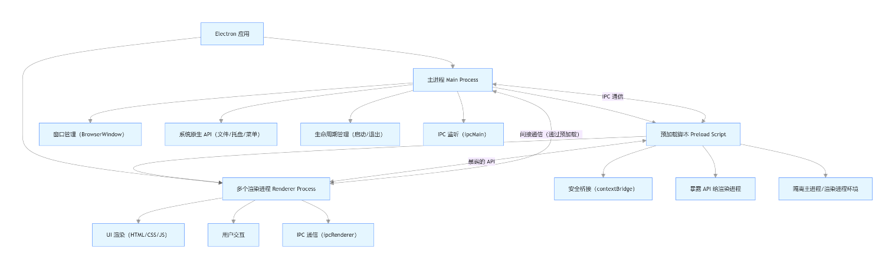
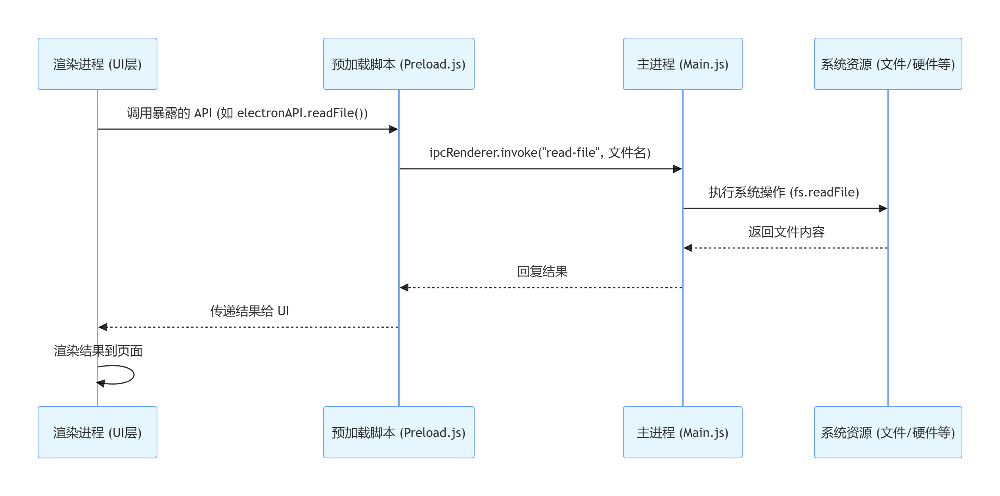
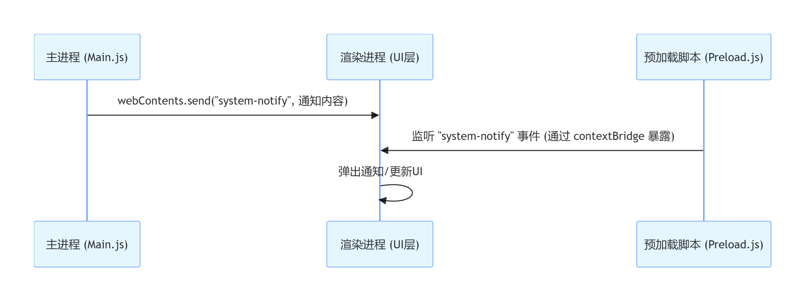
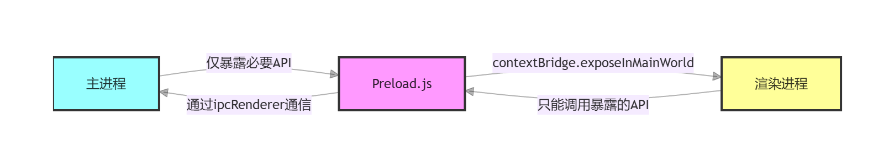
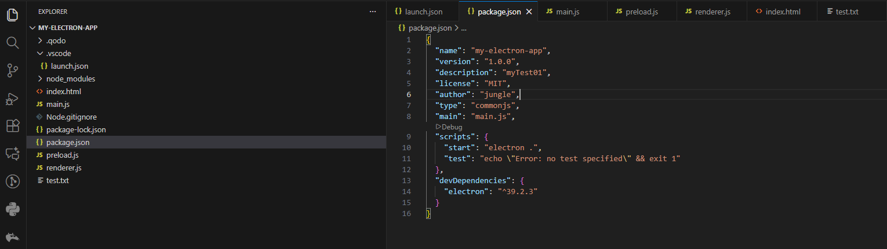
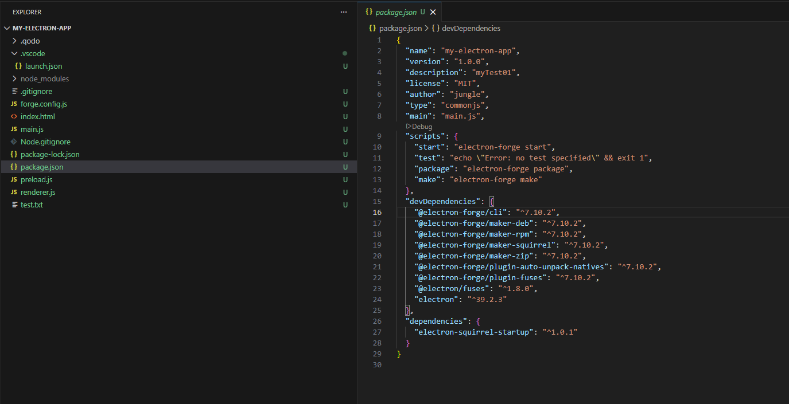
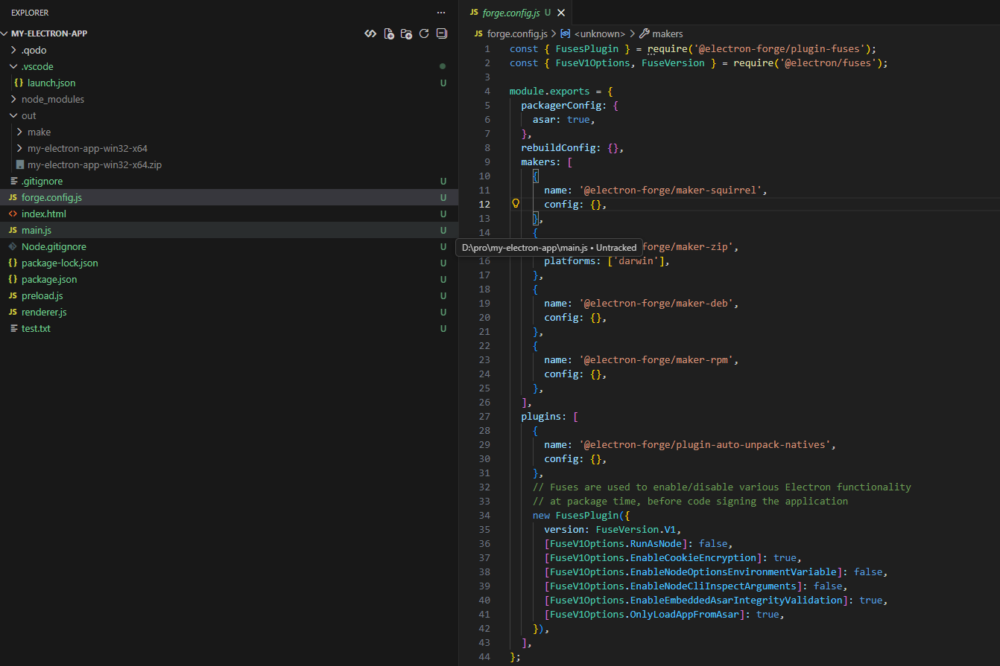

# Electron入门

## 开始命令记录

> https://www.electronjs.org/zh/docs/latest/tutorial/tutorial-first-app

Electron 应用基于 npm 搭建，以 package.json 文件作为入口点。 首先创建一个文件夹，然后在其中执行 `npm init` 初始化项目。

```npm
mkdir my-electron-app && cd my-electron-app
npm init
```

这条命令会帮您配置 package.json 中的一些字段。 为本教程的目的，有几条规则需要遵循：

- *入口点* 应当是 `main.js` (您很快就会创建它)
- *author*、*license* 和 *description* 可以是任何值，但在稍后的[packaging](https://www.electronjs.org/zh/docs/latest/tutorial/打包教程)中是必需的。

然后，将 Electron 安装为您项目的 **devDependencies**，即仅在开发环境需要的额外依赖。

```npm
npm install electron --save-dev
```

**package.json**

```json
{
  "name": "my-electron-app",
  "version": "1.0.0",
  "description": "myTest01",
  "license": "MIT",
  "author": "jungle",
  "type": "commonjs",
  "main": "main.js",
  "scripts": {
    "start": "electron .",
    "test": "echo \"Error: no test specified\" && exit 1"
  },
  "devDependencies": {
    "electron": "^39.2.3"
  }
}
```

> [`.gitignore`](https://git-scm.com/docs/gitignore) 文件可以指定哪些文件和目录应该在Git中不被跟踪。 建议您复制一份 [GitHub 的 Node.js gitignore 模板](https://github.com/github/gitignore/blob/main/Node.gitignore) 到您项目的根目录，以避免将 `node_modules` 文件夹提交到版本控制系统中。

```yaml
# Logs
logs
*.log
npm-debug.log*
yarn-debug.log*
yarn-error.log*
lerna-debug.log*

# Diagnostic reports (https://nodejs.org/api/report.html)
report.[0-9]*.[0-9]*.[0-9]*.[0-9]*.json

# Runtime data
pids
*.pid
*.seed
*.pid.lock

# Directory for instrumented libs generated by jscoverage/JSCover
lib-cov

# Coverage directory used by tools like istanbul
coverage
*.lcov

# nyc test coverage
.nyc_output

# Grunt intermediate storage (https://gruntjs.com/creating-plugins#storing-task-files)
.grunt

# Bower dependency directory (https://bower.io/)
bower_components

# node-waf configuration
.lock-wscript

# Compiled binary addons (https://nodejs.org/api/addons.html)
build/Release

# Dependency directories
node_modules/
jspm_packages/

# Snowpack dependency directory (https://snowpack.dev/)
web_modules/

# TypeScript cache
*.tsbuildinfo

# Optional npm cache directory
.npm

# Optional eslint cache
.eslintcache

# Optional stylelint cache
.stylelintcache

# Optional REPL history
.node_repl_history

# Output of 'npm pack'
*.tgz

# Yarn Integrity file
.yarn-integrity

# dotenv environment variable files
.env
.env.*
!.env.example

# parcel-bundler cache (https://parceljs.org/)
.cache
.parcel-cache

# Next.js build output
.next
out

# Nuxt.js build / generate output
.nuxt
dist
.output

# Gatsby files
.cache/
# Comment in the public line in if your project uses Gatsby and not Next.js
# https://nextjs.org/blog/next-9-1#public-directory-support
# public

# vuepress build output
.vuepress/dist

# vuepress v2.x temp and cache directory
.temp
.cache

# Sveltekit cache directory
.svelte-kit/

# vitepress build output
**/.vitepress/dist

# vitepress cache directory
**/.vitepress/cache

# Docusaurus cache and generated files
.docusaurus

# Serverless directories
.serverless/

# FuseBox cache
.fusebox/

# DynamoDB Local files
.dynamodb/

# Firebase cache directory
.firebase/

# TernJS port file
.tern-port

# Stores VSCode versions used for testing VSCode extensions
.vscode-test

# yarn v3
.pnp.*
.yarn/*
!.yarn/patches
!.yarn/plugins
!.yarn/releases
!.yarn/sdks
!.yarn/versions

# Vite files
vite.config.js.timestamp-*
vite.config.ts.timestamp-*
.vite/

```

**启动**

```npm
npm run start
```


## 逻辑架构

### 一、Electron 整体架构流程图（核心组件关系）

> https://www.electronjs.org/zh/docs/latest/tutorial/process-model

**流程图核心说明：**

1. **顶层组件**：Electron 应用由「1 个主进程」+「N 个渲染进程」组成，二者是独立环境，不能直接通信；
2. **主进程能力**：运行在 Node.js 环境，直接操作系统原生资源（文件、菜单、托盘等）；
3. **渲染进程能力**：运行在 Chromium 环境，负责 HTML/CSS/JS 渲染和用户交互；
4. **安全桥梁**：预加载脚本（Preload.js）是主进程和渲染进程之间的安全中间层，通过 `contextBridge` 暴露有限 API；
5. **通信核心**：IPC 是唯一通信方式，主进程用 `ipcMain`、渲染进程用 `ipcRenderer` 对接。



### 二、核心交互流程图（3 个高频场景）

#### 场景 1：渲染进程 → 主进程（请求系统资源，如读取文件）



#### 场景 2：主进程 → 渲染进程（推送消息，如系统通知）。



#### 场景 3：预加载脚本的安全桥作用



## 加载文件案例

> 做一个加载文本文件的案例：

### main.js 【主进程】

```js
const { app, BrowserWindow, ipcMain } = require('electron');
const path = require('path');
const fs = require('fs').promises; // 用 Promise 风格的 fs

// 创建窗口
function createWindow() {
  const mainWindow = new BrowserWindow({
    width: 800,
    height: 600,
    webPreferences: {
      contextIsolation: true, // 开启上下文隔离（安全）
      nodeIntegration: false, // 关闭渲染进程的 Node.js 集成
      preload: path.join(__dirname, 'preload.js') // 指定预加载脚本
    }
  });

  mainWindow.loadFile('index.html'); // 加载渲染进程页面
}

// 监听渲染进程的「读取文件」请求（核心 IPC 处理）
ipcMain.handle('read-file-request', async (event, filePath) => {
  try {
    const content = await fs.readFile(filePath, 'utf8');
    return { success: true, content }; // 返回成功结果
  } catch (err) {
    return { success: false, error: err.message }; // 返回错误信息
  }
});

app.whenReady().then(createWindow);
```

#### 一、模块导入：Electron 核心能力的引入

```js
const { app, BrowserWindow, ipcMain } = require('electron');
const path = require('path');
const fs = require('fs').promises;
```

这部分是 Node.js 风格的模块导入，也是 Electron 主进程的基础配置：

- **`app` 模块**：Electron 应用的生命周期管家，负责管理应用的启动、就绪、退出等全局事件，是控制应用生命周期的核心。
- **`BrowserWindow` 类**：窗口的 “构造器”，用于创建和控制应用窗口，每个实例对应一个独立的渲染窗口。
- **`ipcMain` 模块**：主进程的 IPC 通信入口，专门监听渲染进程发送的请求，实现进程间数据交互。
- **`path` 模块**：Node.js 内置模块，处理文件路径的拼接和解析，解决跨平台路径差异问题（如 Windows 的 `\` 和 macOS/Linux 的 `/`）。
- **`fs.promises`**：Node.js 文件系统模块的 Promise 版本，提供异步非阻塞的文件操作 API（如 `readFile`），配合 `async/await` 使用更简洁。

#### 二、窗口创建函数：`createWindow()` 的设计思路

> - [`__dirname`](https://nodejs.org/api/modules.html#modules_dirname) 字符串指向当前正在执行的脚本的路径(在本例中，它指向你的项目的根文件夹)。
> - [`path.join`](https://nodejs.org/api/path.html#path_path_join_paths) API 将多个路径联结在一起，创建一个跨平台的路径字符串。

```js
function createWindow() {
  const mainWindow = new BrowserWindow({
    width: 800,
    height: 600,
    webPreferences: {
      contextIsolation: true, // 开启上下文隔离（安全）
      nodeIntegration: false, // 关闭渲染进程的 Node.js 集成
      preload: path.join(__dirname, 'preload.js') // 指定预加载脚本
    }
  });

  mainWindow.loadFile('index.html'); // 加载渲染进程页面
}
```

`createWindow` 是封装窗口创建逻辑的核心函数，体现了 Electron 的安全设计和窗口配置原则：

##### 1. 窗口配置参数解析

- **基础尺寸**：`width: 800` 和 `height: 600` 定义了窗口的初始大小，也可通过 `minWidth`/`maxWidth` 限制窗口缩放范围。

- **`webPreferences`：安全配置的核心**

  这是 Electron 安全最佳实践的关键，必须重点关注：

  - `contextIsolation: true`：开启上下文隔离，将渲染进程的 JavaScript 环境与 Electron 的内部环境隔离开，防止恶意代码访问 Electron 的 API，是现代 Electron 应用的标配。
  - `nodeIntegration: false`：关闭渲染进程的 Node.js 集成，避免渲染进程直接访问文件系统、网络等敏感资源，所有系统操作必须通过主进程完成。
  - `preload: path.join(__dirname, 'preload.js')`：指定预加载脚本路径，这是主进程和渲染进程之间的 “安全桥梁”，用于暴露有限的 API 给渲染进程。

##### 2. 加载渲染进程页面

`mainWindow.loadFile('index.html')` 表示加载本地的 `index.html` 文件作为窗口内容，这是渲染进程的入口。也可通过 `loadURL('https://xxx.com')` 加载远程网页，但本地文件更安全。

#### 三、IPC 通信处理：`ipcMain.handle()` 的作用

```js
ipcMain.handle('read-file-request', async (event, filePath) => {
  try {
    const content = await fs.readFile(filePath, 'utf8');
    return { success: true, content }; // 返回成功结果
  } catch (err) {
    return { success: false, error: err.message }; // 返回错误信息
  }
});
```

这是主进程处理渲染进程请求的核心逻辑，体现了 Electron 的进程分工原则：

##### 1. `ipcMain.handle()` 的特点

- 这是 Electron 推荐的异步通信方式，配合渲染进程的 `ipcRenderer.invoke()` 使用，支持返回 Promise 结果。
- 第一个参数 `'read-file-request'` 是通信的 “频道名”，必须与渲染进程的请求频道一致。
- 第二个参数是异步处理函数，接收两个参数：
  - `event`：包含通信的上下文信息（如发送请求的窗口、进程 ID 等）。
  - `filePath`：渲染进程传递的参数（如要读取的文件路径）。

##### 2. 文件操作的分工逻辑

- 渲染进程没有直接操作文件的权限，必须通过 IPC 请求主进程完成。
- 主进程使用 `fs.promises.readFile` 异步读取文件，避免阻塞主线程。
- 返回统一格式的结果：成功时返回 `{ success: true, content }`，失败时返回 `{ success: false, error }`，方便渲染进程处理。

#### 四、应用启动逻辑：`app.whenReady()` 的触发时机

```js
app.whenReady().then(createWindow);
```

这是应用启动的关键，`app.whenReady()` 会等待 Electron 应用完成初始化（就绪状态）后执行回调函数，此时才能安全地创建窗口。

- 在 Windows/Linux 上，应用就绪后直接创建窗口；
- 在 macOS 上，即使没有窗口，应用也会保持运行，点击 Dock 图标时会触发 `activate` 事件重新创建窗口（可补充 `app.on('activate', ...)` 逻辑完善）。

#### 五、代码的设计原则与最佳实践

这段代码遵循了 Electron 开发的核心原则：

1. **安全优先**：开启上下文隔离、关闭 Node.js 集成、使用预加载脚本，防止安全漏洞。
2. **进程分工**：主进程负责系统操作（文件读写、窗口管理），渲染进程负责 UI 展示和用户交互，通过 IPC 通信协作。
3. **异步非阻塞**：使用 `fs.promises` 和 `async/await`，避免同步操作阻塞主线程，保证应用响应流畅。
4. **模块化封装**：将窗口创建逻辑封装为 `createWindow` 函数，代码更易维护和扩展。


------

### preload.js 【预加载脚本】

```js
const { contextBridge, ipcRenderer } = require('electron');

contextBridge.exposeInMainWorld('electronAPI', {
  readFile: (filePath) => ipcRenderer.invoke('read-file-request', filePath)
});
```

#### 一、核心模块导入：`contextBridge` 与 `ipcRenderer`

```js
const { contextBridge, ipcRenderer } = require('electron');
```

- **`contextBridge`**：Electron 提供的安全桥接工具，专门用于在开启 `contextIsolation`（上下文隔离）时，安全地向渲染进程的全局 `window` 对象暴露 API。它的作用是**隔离上下文**，防止渲染进程的恶意代码篡改或访问 Electron 的内部 API。
- **`ipcRenderer`**：渲染进程的 IPC 通信工具，负责向主进程发送请求或接收消息。在预加载脚本中，它是连接渲染进程与主进程的 “通信管道”。

#### 二、`contextBridge.exposeInMainWorld()`：安全暴露 API 的唯一方式

```js
contextBridge.exposeInMainWorld('electronAPI', { /* ... */ });
```

这是预加载脚本的核心方法，含义如下：

1. **`exposeInMainWorld` 的作用**

   将指定的对象暴露到渲染进程的全局 `window` 对象中，使得渲染进程可以通过 `window.electronAPI` 访问这些 API。但它不是简单的赋值，而是通过**安全的上下文桥接**实现，保证：

   - 暴露的 API 不会被渲染进程的代码篡改；
   - 渲染进程无法直接访问 `ipcRenderer` 等敏感模块，只能通过暴露的有限接口操作。

2. **参数解析**

   - 第一个参数 `'electronAPI'`：暴露到 `window` 对象上的属性名，渲染进程通过 `window.electronAPI` 访问。
   - 第二个参数：要暴露的 API 对象，里面定义了渲染进程可以调用的方法。

#### 三、暴露的 API 设计：`readFile` 方法的意义

```js
readFile: (filePath) => ipcRenderer.invoke('read-file-request', filePath)
```

这个方法是预加载脚本的 “业务接口”，设计上体现了**最小权限原则**：

1. **功能封装**

   将 `ipcRenderer.invoke('read-file-request', filePath)` 封装为 `readFile` 方法，渲染进程只需调用 `window.electronAPI.readFile('./test.txt')`，无需关心底层的 IPC 通信细节。

2. **权限控制**

   - 渲染进程只能调用我们明确暴露的 `readFile` 方法，无法直接调用 `ipcRenderer.send` 或其他敏感方法；
   - 该方法只能发起 `'read-file-request'` 频道的请求，无法访问主进程的其他 IPC 频道，实现了 “有限访问”。

3. **异步通信**

   使用 `ipcRenderer.invoke`（异步）而非 `sendSync`（同步），避免阻塞渲染进程的 UI 线程，保证应用响应流畅。

#### 四、预加载脚本的 “安全桥梁” 本质

我们可以用一张图理解预加载脚本的角色：

```plaintext
┌───────────────┐      ┌───────────────┐      ┌───────────────┐
│ 渲染进程       │      │ 预加载脚本     │      │ 主进程        │
│ (UI 层)        │      │ (安全桥)       │      │ (系统层)      │
└───────┬───────┘      └───────┬───────┘      └───────┬───────┘
        │                      │                      │
        │ window.electronAPI.readFile()              │
        │ ───────────────────> │                      │
        │                      │ ipcRenderer.invoke() │
        │                      │ ───────────────────> │
        │                      │                      │ 读取文件
        │                      │                      │ (fs.readFile)
        │                      │                      │
        │                      │ 结果返回             │
        │                      │ <────────────────── │
        │ 结果返回             │                      │
        │ <────────────────── │                      │
        │                      │                      │
```

#### 五、安全意义：为什么需要预加载脚本？

如果没有预加载脚本，直接在渲染进程中使用 `ipcRenderer`，会带来两个严重问题：

1. **安全风险**：渲染进程的代码（尤其是引入第三方库时）可能被篡改，直接访问 `ipcRenderer` 可能导致恶意代码向主进程发送任意请求，甚至执行系统级操作（如删除文件）。
2. **权限失控**：渲染进程可以调用所有 IPC 频道，无法限制其操作范围，违背 “最小权限原则”。

而预加载脚本通过 `contextBridge` 实现：

- **隔离**：渲染进程与 Electron 内部 API 隔离，只能通过暴露的有限接口操作；
- **可控**：开发者可以精确控制渲染进程能调用的方法，避免权限滥用；
- **安全**：即使渲染进程的代码被篡改，也无法突破预加载脚本的限制。

#### 六、扩展：更完善的预加载脚本设计

在实际项目中，你可以扩展这个结构，暴露更多 API，同时保持安全性：

```js
const { contextBridge, ipcRenderer } = require('electron');

// 暴露多个 API，按功能分类
contextBridge.exposeInMainWorld('electronAPI', {
  // 文件操作相关
  file: {
    read: (filePath) => ipcRenderer.invoke('file-read', filePath),
    write: (filePath, content) => ipcRenderer.invoke('file-write', filePath, content)
  },
  // 窗口操作相关
  window: {
    minimize: () => ipcRenderer.send('window-minimize'),
    maximize: () => ipcRenderer.send('window-maximize')
  },
  // 监听主进程消息
  on: {
    statusUpdate: (callback) => ipcRenderer.on('status-update', (_, data) => callback(data))
  }
});
```

渲染进程使用时更清晰：

```js
// 读取文件
await window.electronAPI.file.read('./test.txt');
// 最小化窗口
window.electronAPI.window.minimize();
// 监听状态更新
window.electronAPI.on.statusUpdate((data) => console.log(data));
```

这段预加载脚本的核心价值在于：

1. **安全隔离**：通过 `contextBridge` 实现渲染进程与 Electron 内部 API 的隔离，防止权限滥用；
2. **有限暴露**：只暴露渲染进程需要的 API，遵循 “最小权限原则”；
3. **简化调用**：封装 IPC 通信细节，让渲染进程以更直观的方式调用主进程功能。

预加载脚本就像一个 “安检站”，所有渲染进程的请求都必须通过这里，既保证了通信的顺畅，又守住了安全的底线 —— 这正是它被称为 “安全桥梁” 的原因！

---

### 渲染进程

#### Electron 渲染进程实现：从界面到交互的完整解析

渲染进程是 Electron 应用的 “前端层”，负责界面展示和用户交互，通过预加载脚本暴露的 API 与主进程通信。我们来逐部分解析这段代码：

##### 一、HTML 界面结构：`index.html`

```html
<!DOCTYPE html>
<html>
<body>
  <button id="readBtn">读取文件</button>
  <div id="result"></div>

  <!-- 引入外部渲染进程脚本 -->
  <script src="./renderer.js"></script>
</body>
</html>
```

这是渲染进程的界面入口，遵循 “结构与逻辑分离” 的前端开发原则：

###### 1. 界面元素设计

- **`<button id="readBtn">读取文件</button>`**：用户交互的触发按钮，通过 `id="readBtn"` 让 JS 代码获取并绑定事件。
- **`<div id="result"></div>`**：结果展示区域，用于显示文件读取的内容或错误信息，是界面与用户的反馈通道。

###### 2. 脚本引入方式

<script src="./renderer.js"></script> 将交互逻辑拆分到独立的 renderer.js 文件中，而非内嵌在 HTML 中，这是现代前端开发的最佳实践：

- **关注点分离**：HTML 负责结构，JS 负责逻辑，代码更易维护；
- **复用性**：`renderer.js` 可被多个 HTML 页面引用；
- **调试便捷**：浏览器开发者工具可直接定位到独立 JS 文件的代码行。

##### 二、交互逻辑实现：`renderer.js`

```js
// renderer.js - 渲染进程的独立脚本文件
const readBtn = document.getElementById('readBtn');
const resultDiv = document.getElementById('result');

readBtn.addEventListener('click', async () => {
  // 调用预加载脚本暴露的 API
  const response = await window.electronAPI.readFile('./test.txt');
  
  // 处理结果并渲染到页面
  if (response.success) {
    resultDiv.textContent = `文件内容：\n${response.content}`;
  } else {
    resultDiv.textContent = `错误：${response.error}`;
  }
});
```

这是渲染进程的交互核心，体现了 “UI 交互 → 进程通信 → 结果展示” 的完整流程：

###### 1. DOM 元素获取

```js
const readBtn = document.getElementById('readBtn');
const resultDiv = document.getElementById('result');
```

通过 `document.getElementById` 获取界面元素，这是原生 JavaScript 操作 DOM 的基础方式，也可使用框架（如 Vue/React）简化操作，但原生方式更能体现 Electron 渲染进程的本质。

###### 2. 事件绑定与异步处理

```js
readBtn.addEventListener('click', async () => { /* ... */ });
```

- **点击事件绑定**：为按钮绑定 `click` 事件，用户点击时触发后续逻辑，是前端交互的核心触发方式。
- **`async/await` 异步处理**：由于调用主进程的 API 是异步操作（文件读取需要时间），使用 `async/await` 语法让异步代码更简洁可读，避免回调地狱。

###### 3. 调用预加载脚本的 API

```js
const response = await window.electronAPI.readFile('./test.txt');
```

这是渲染进程与主进程通信的关键步骤：

- **`window.electronAPI`**：预加载脚本通过 `contextBridge` 暴露到全局 `window` 对象的 API 集合，是渲染进程访问主进程功能的唯一入口。
- **`readFile('./test.txt')`**：调用预加载脚本暴露的文件读取方法，传递文件路径参数 `./test.txt`，底层通过 `ipcRenderer.invoke` 向主进程发送请求。

这是 “数据驱动视图” 的体现：

- 根据主进程返回的结果（成功 / 失败），动态更新界面内容；
- 使用 `textContent` 而非 `innerHTML`，避免 XSS 攻击风险（安全最佳实践）；
- 成功时显示文件内容，失败时显示错误信息，给用户清晰的反馈。

###### 三、渲染进程的核心特点

这段代码体现了 Electron 渲染进程的几个关键特性：

1. **浏览器环境特性**

   渲染进程本质上是 Chromium 浏览器的一个标签页，完全支持 HTML/CSS/JavaScript 及浏览器 API（如 DOM 操作、事件监听），可以使用任何前端框架（Vue/React/Angular）开发。

2. **权限限制**

   渲染进程没有直接访问系统资源的权限（如文件读写），必须通过预加载脚本暴露的 API 与主进程通信，由主进程完成敏感操作，这是 Electron 的安全设计。

3. **与主进程的协作模式**

   渲染进程负责 “发起请求” 和 “展示结果”，主进程负责 “处理请求” 和 “返回结果”，两者通过 IPC 通信协作，分工明确。

###### 四、扩展：更健壮的渲染进程设计

在实际项目中，可以对这段代码进行增强，提升用户体验和代码健壮性：

```js
// renderer.js 增强版
const readBtn = document.getElementById('readBtn');
const resultDiv = document.getElementById('result');

// 加载状态处理
readBtn.addEventListener('click', async () => {
  // 禁用按钮，防止重复点击
  readBtn.disabled = true;
  readBtn.textContent = '读取中...';
  resultDiv.textContent = '';

  try {
    const response = await window.electronAPI.readFile('./test.txt');
    
    if (response.success) {
      // 格式化显示文本（保留换行）
      resultDiv.style.whiteSpace = 'pre-wrap';
      resultDiv.textContent = `文件内容：\n${response.content}`;
    } else {
      // 错误样式提示
      resultDiv.style.color = 'red';
      resultDiv.textContent = `错误：${response.error}`;
    }
  } catch (err) {
    // 捕获通信过程中的异常
    resultDiv.style.color = 'red';
    resultDiv.textContent = `通信错误：${err.message}`;
  } finally {
    // 恢复按钮状态
    readBtn.disabled = false;
    readBtn.textContent = '读取文件';
  }
});
```

增强点包括：

- 按钮状态管理（禁用 / 恢复），防止重复请求；
- 加载状态提示，提升用户体验；
- 错误捕获与样式区分，反馈更清晰；
- 文本格式化显示，保留换行符。


#### test.txt

```js
Hello Electron!
这是测试文件的内容。
```


---

## 启动配置

### 目录结构

这是 Electron 主进程的典型实现，涵盖了**窗口创建**、**安全配置**、**IPC 通信**和**文件操作**四大核心功能。其设计思路可总结为：

- 主进程是 “管理者”，负责系统资源和窗口生命周期；
- 渲染进程是 “展示者”，负责 UI 交互，无敏感操作权限；
- 预加载脚本是 “安全桥梁”，实现有限的 API 暴露；
- IPC 通信是 “协作方式”，保证进程间数据安全交互。

这些原则不仅适用于文件操作，也适用于数据库访问、网络请求等所有系统级操作，是构建稳定、安全的 Electron 应用的基础。



### package.json

> package.json

```json
{
  "name": "my-electron-app",
  "version": "1.0.0",
  "description": "myTest01",
  "license": "MIT",
  "author": "jungle",
  "type": "commonjs",
  "main": "main.js",
  "scripts": {
    "start": "electron .",
    "test": "echo \"Error: no test specified\" && exit 1"
  },
  "devDependencies": {
    "electron": "^39.2.3"
  }
}
```

### launch.json

> .vscode\launch.json

```json
{
  "version": "0.2.0",
  "compounds": [
    {
      "name": "Main + renderer",
      "configurations": ["Main", "Renderer"],
      "stopAll": true
    }
  ],
  "configurations": [
    {
      "name": "Renderer",
      "port": 9222,
      "request": "attach",
      "type": "chrome",
      "webRoot": "${workspaceFolder}"
    },
    {
      "name": "Main",
      "type": "node",
      "request": "launch",
      "cwd": "${workspaceFolder}",
      "runtimeExecutable": "${workspaceFolder}/node_modules/.bin/electron",
      "windows": {
        "runtimeExecutable": "${workspaceFolder}/node_modules/.bin/electron.cmd"
      },
      "args": [".", "--remote-debugging-port=9222"],
      "outputCapture": "std",
      "console": "integratedTerminal"
    }
  ]
}
```


---

## 如何打包

Electron 的核心模块中没有捆绑任何用于打包或分发文件的工具。 如果您在开发模式下完成了一个 Electron 应用，需要使用额外的工具来打包应用程序 (也称为**可分发文件**) 并分发给用户 。 可分发文件可以是安装程序 (例如 Windows 上的 MSI) 或者绿色软件 (例如 macOS 上的 `.app` 文件)。

Electron Forge 是一个处理 Electron 应用程序打包与分发的一体化工具。 在工具底层，它将许多现有的 Electron 工具 (例如 [`@electron/packager`](https://github.com/electron/packager)、 [`@electron/osx-sign`](https://github.com/electron/osx-sign)、[`electron-winstaller`](https://github.com/electron/windows-installer) 等) 组合到一起，因此您不必费心处理不同系统的打包工作。

### 导入你的项目到 Forge

> https://www.electronjs.org/zh/docs/latest/tutorial/打包教程#导入你的项目到-forge

将 Electron Forge 的 CLI 工具包安装到项目的 `devDependencies` 依赖中，然后使用现成的转化脚本将项目导入至 Electron Forge。

 **关闭vscode使用CMD等工具输入以下命令：**

```bash
Set-ExecutionPolicy Bypass -Scope Process -Force
npm install --save-dev @electron-forge/cli
npx electron-forge import
```

**成功日志：**

```bash
$ npx electron-forge import
√ Checking your system
√ Locating importable project
√ Processing configuration and dependencies
  √ Resolving package manager: npm
  √ Configuring Yarn (if applicable)
  √ Installing dependencies
  √ Copying base template Forge configuration
  √ Fixing .gitignore
√ Finalizing import

› We have attempted to convert your app to be in a format that Electron Forge
understands.

Thanks for using Electron Forge!
```



转换脚本完成后，Forge 会将一些脚本添加到您的 `package.json` 文件中。

```json
{
  "name": "my-electron-app",
  "version": "1.0.0",
  "description": "myTest01",
  "license": "MIT",
  "author": "jungle",
  "type": "commonjs",
  "main": "main.js",
  "scripts": {
    "start": "electron-forge start",
    "test": "echo \"Error: no test specified\" && exit 1",
    "package": "electron-forge package",
    "make": "electron-forge make"
  },
  "devDependencies": {
    "@electron-forge/cli": "^7.10.2",
    "@electron-forge/maker-deb": "^7.10.2",
    "@electron-forge/maker-rpm": "^7.10.2",
    "@electron-forge/maker-squirrel": "^7.10.2",
    "@electron-forge/maker-zip": "^7.10.2",
    "@electron-forge/plugin-auto-unpack-natives": "^7.10.2",
    "@electron-forge/plugin-fuses": "^7.10.2",
    "@electron/fuses": "^1.8.0",
    "electron": "^39.2.3"
  },
  "dependencies": {
    "electron-squirrel-startup": "^1.0.1"
  }
}

```

您还应该注意到您的 package.json 现在安装了更多的包 在 `devDependencies` 下，以及一个导出配置的新 `forge.config.js` 文件 目的。 您应该在预填充的配置中看到多个makers（生成可分发应用程序包的包），每个目标平台一个。

### **forge.config.js**

```json
const { FusesPlugin } = require('@electron-forge/plugin-fuses');
const { FuseV1Options, FuseVersion } = require('@electron/fuses');

module.exports = {
  packagerConfig: {
    asar: true,
  },
  rebuildConfig: {},
  makers: [
    {
      name: '@electron-forge/maker-squirrel',
      config: {},
    },
    {
      name: '@electron-forge/maker-zip',
      platforms: ['darwin'],
    },
    {
      name: '@electron-forge/maker-deb',
      config: {},
    },
    {
      name: '@electron-forge/maker-rpm',
      config: {},
    },
  ],
  plugins: [
    {
      name: '@electron-forge/plugin-auto-unpack-natives',
      config: {},
    },
    // Fuses are used to enable/disable various Electron functionality
    // at package time, before code signing the application
    new FusesPlugin({
      version: FuseVersion.V1,
      [FuseV1Options.RunAsNode]: false,
      [FuseV1Options.EnableCookieEncryption]: true,
      [FuseV1Options.EnableNodeOptionsEnvironmentVariable]: false,
      [FuseV1Options.EnableNodeCliInspectArguments]: false,
      [FuseV1Options.EnableEmbeddedAsarIntegrityValidation]: true,
      [FuseV1Options.OnlyLoadAppFromAsar]: true,
    }),
  ],
};

```

### 创建一个可分发版本

要创建可分发文件，请使用项目中的 `make` 脚本，该脚本最终运行了 `electron-forge make` 命令。

```js
npm run make
```

该 `make` 命令包含两步：

1. 它将首先运行 `electron-forge package` ，把您的应用程序 代码与 Electron 二进制包结合起来。 完成打包的代码将会被生成到一个特定的文件夹中。
2. 然后它将使用这个文件夹为每个 maker 配置生成一个可分发文件。

在脚本运行后，您应该看到一个 `out` 文件夹，其中包括可分发文件与一个包含其源码的文件夹。



> 可分发文件格式
>
> Electron Forge 通过配置可以为不同的操作系统创建特定格式的可分发文件 (例如 DMG、deb、MSI 等)。 相关配置选项详情，请参阅 Forge 的 [Makers](https://www.electronforge.io/config/makers) 文档。


> 创建和添加应用程序图标
>
> 设置自定义的应用程序图标，需要添加一些额外的配置。 查看 [Forge 的图标教程](https://www.electronforge.io/guides/create-and-add-icons) 了解更多信息。


